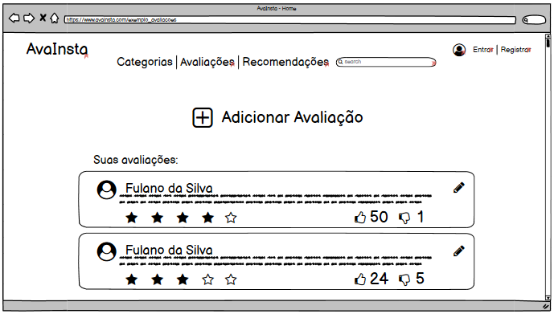
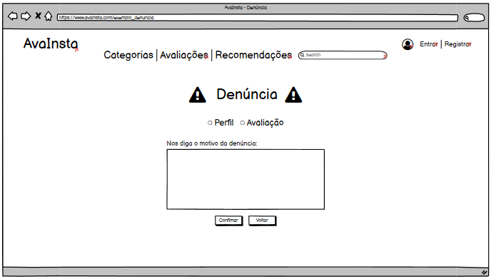

# &ensp;Protótipo de baixa fidelidade
---

## &emsp;Introdução

&emsp;Este documento tem o intuito de nos dar uma noção inicial de como ficará o site AvaInsta no quesito visual, sendo ele de forma genérica e sujeito a alterações futuras.

## &emsp;Página inicial.

&emsp;A página inicial, como diz o nome, será a primeira página que o usuário verá ao acessar o site.

## &emsp;Página de avaliações.

&emsp;A página de avaliações será onde o usuário vai poder ver as próprias avaliações e também realizar uma nova avaliação de produto.

## &emsp;Página de recomendações.

&emsp;A página de recomendações será onde o usuário conseguirá visualizar as avaliações de outros usuários, tendo aqui a possibilidade de avaliar outras recomendações e também realizar uma denúncia se necessário.

## &emsp;Página de cadastro de avaliação.

&emsp;A página de cadastro de avaliações será acessada a partir da página de avaliações, e nela será onde o usuário irá inserir todas as informações sobre uma nova avaliação, desde que esteja logado no site.

## &emsp;Página de cadastro de Usuário.

&emsp;A página de cadastro de usuário será acessada a partir do canto superior direito da tela ou da página de login. Nesta será onde um novo usuário poderá se cadastrar, para só a partir daí ter autorização para realizar uma avaliação de produto ou de outra avaliação.

## &emsp;Página de login.

&emsp;A página de login poderá ser acessada a partir do canto superior direito da tela, sendo onde o usuário irá colocar seus dados pré cadastrados para poder ter acesso a avaliação de novos produtos. Caso não haja um cadastro, poderá realizar um novo registro a partir do botão registro.

## &emsp;Página de denúncias.

&emsp;A página de denúncia será acessável a partir do botão de denúncia presente em cada recomendação, mas para finalizar uma denúncia o usuário deve estar com o login efetuado.

---