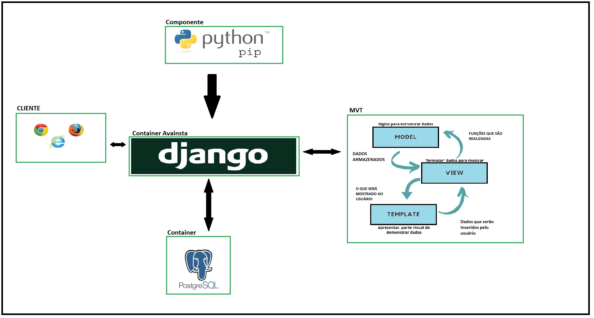
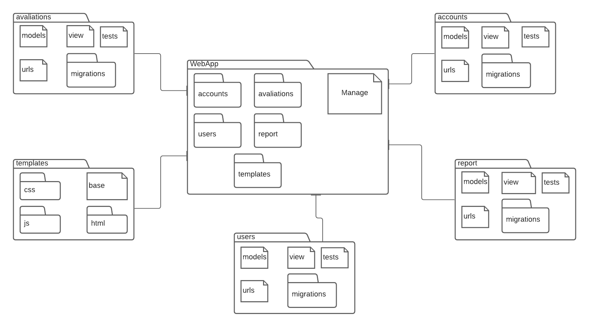
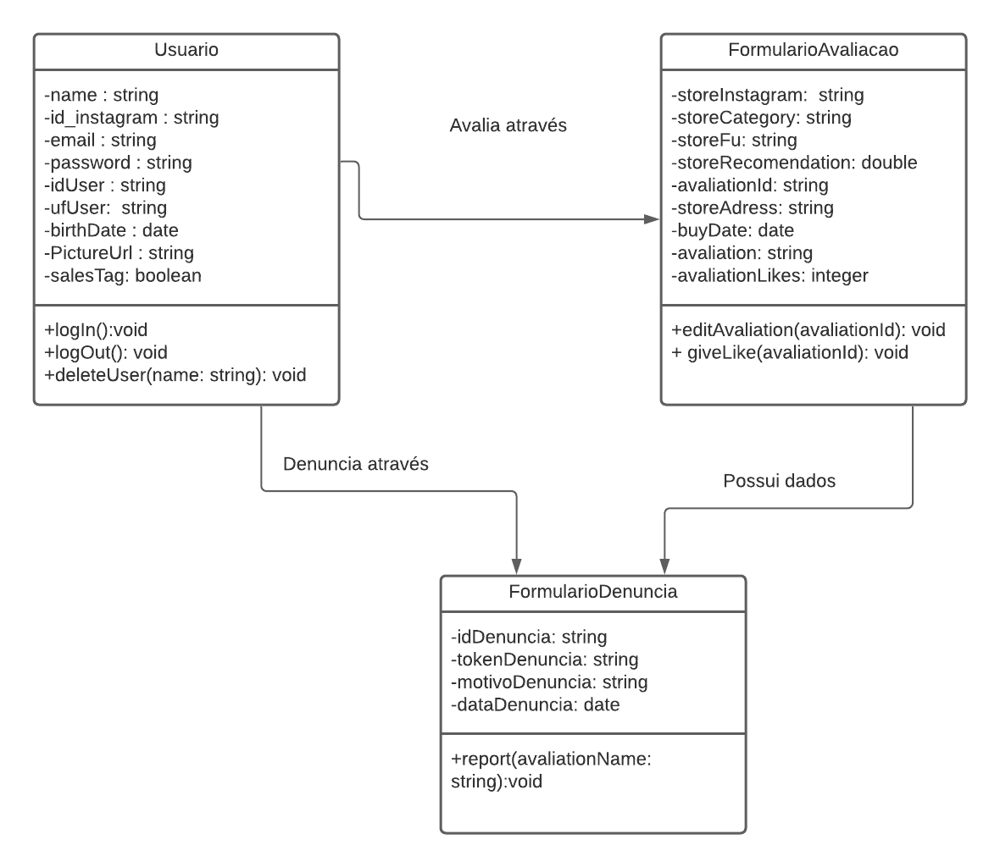

# &ensp;Documento de Arquitetura
---

## &ensp;Histórico de Revisão

 Data       | Versão | Modificação           | Autor             
 :--------: | :----: | :-------------------- | :------------
 22/03/2021 | 0.1    | Criação do documento  | Luíz Gustavo      
25/03/2021 | 0.2    |  acrescentando a representação da arquitetura e visão geral  | Felipe Chermont
27/03/2021 | 0.3    |  Atualizando parte do documento 2, 3.1, 3.2 | Deivid e Victor |
30/03/2021 | 0.4    |  Atualizando a visão de Dados e as Referências | Deivid e Victor |
22/04/2021 | 0.4    |  Retirando o Visao de casos de Uso| Felipe Chermont |
---

 

## 1. Introdução

### &emsp;1.1 Objetivo

&emsp;A finalidade deste documento é listar os passos seguidos para realizar o projeto AvaInsta, sendo assim, estão inclusos neste a arquitetura utilizada e também as ferramentas de desenvolvimento.

### &emsp;1.2 Escopo

&emsp;O AvaInsta visa ser uma aplicação web voltada para usuários do aplicatico Instagram, funcionando como sistema de avaliações e recomendações de perfis de venda do mesmo. 
    
## 2. Representação da Arquitetura

Representação dos serviços e modelos implementados na aplicação. A arquitetura utilizada no projeto será a arquitetura baseada no modelo MVC.
A aplicação web Avainsta será feita pelo Django, um framework escrito em python. O modelo de arquitetura utilizado dentro do framework Django é o MVT (Model, View e Template), que é derivada do padrão arquitetural MVC (Model, View e Controller). De acordo com o The Django Book, a parte de controller, em Django, é tratada pelo próprio framework. Portanto a View do MVT desempenha um papel próximo, mas não igual ao controller. Em função disso, sempre que for feita uma requisição do front, o django exige que sempre seja devolvido alguma coisa.

### 2.1 Tecnologias

### &emsp;2.1.1 Front End

- BootStrap

O bootstrap é um framework web com código-fonte aberto para desenvolvimento de componentes de interface e front-end para sites e aplicações web que usam majoritariamente HTML, CSS e JavaScript.

A escolha de se utilizar este framework se da por ser um dos projetos mais bem avaliados e utilizados no [GitHub](https://github.com/) e possuir uma documentação ampla, além da facilidade de implementação e utilização.

### &emsp;2.1.2 Back End

- Django

O Django é um framework para desenvolvimento web, escrito em Python que utiliza o padrão model-template-view(MTV).

O Django é ótimo para aplicações menores e que precisam de implementação rápida, como é o caso do AvaInsta. Segue o principio DRY (Don't Repeat Yourself), que busca o melhor aproveitamento do código feito e evita repetições e conta com diversos pacotes prontos para auxiliar e otimizar o desenvolvimento do projeto.

### &emsp;2.1.3 Banco de Dados

- PostgreSQL

É um sistema gerenciador de banco de dados objeto relacional, desenvolvido com código aberto.

O postgreSQL é capaz de lidar desde pequenas a grandes aplicações, estando em desenvolvimento a mais de 30 anos e comportanto quaisquer necessidades que o projeto possa precisar.

O projeto  utilizará o PostgreSQL como o banco de dados da aplicação Avainsta, por ser simples a utilização e pela segurança.

## 3. Metas e Restrições

### &emsp;3.1 Metas

Desenvolver uma aplicação de avaliação web que avalia e recomenda produtos comprados em lojas informais do instagram.

### &emsp;3.2 Restrições

| Requisito | Ferramenta/Solução |
|---|---|
|Linguagem| Python 3 |
|Framework| Django 2 |
|FrontEnd| BootStrap |
|Plataforma| Web |
|Segurança | Provida pelo próprio framework Django |
|Linguagem Natural |  Lingua Portuguesa |

## 4. Visão Geral

A visão geral demonstra, através de diagramas, a aplicação e modelo de implementação do AvaInsta, baseado nas tecnologias e frameworks que serão utilizados em seu desenvolvimento.

### &emsp;4.1 Visão de Implementação

A visualização de implementação contém uma visão geral do modelo de implementação e organização dos pacotes e camadas do projeto.

O projeto segue a arquitetura proposta pelo framework Django, onde cada aplicação do projeto é separada em uma pasta contendo os seguintes arquivos e espeficicações:

+ **models.py:** Serve como modelo de classe que será salva no banco de dados

+ **urls.py:** Funciona como um endpoint. Usado na conexão da aplicação com os templates desenvolvidos.

+ **views.py:** Recebe a requisição Web e retorna uma resposta, sendo ela o conteudo da página.

+ **tests.py:** Onde será realizado todos os tipos de testes necessários para o projeto.

Como pode ser visualizado através do Diagrama de pacotes:

### &emsp;4.2 Visão de Dados

A visão de dados fornece uma visualização melhor do que será armazenado no banco de dados do projeto.
Como pode ser observado através do diagrama de classes: 

 

## 5. Referências

 - Flávio Seccheiri Mariotti "Como documentar a Arquitetura de Software" disponível em: http://www.linhadecodigo.com.br/artigo/3343/como-documentar-a-arquitetura-de-software.aspx. Acesso em 22 março 2021.
- Matt Behrens, 2012. The Django Book. Disponível em:  https://django-book.readthedocs.io/en/latest/. Acesso em 27 março 2021
- PostgreSQL: powerful, open source database. 2021 The PostgreSQL Global Development Group Disponível em: https://www.postgresql.org/ . Acesso em 30 março 2021
- BootStrap: Build fast, responsive sites. Disponível em: https://getbootstrap.com/ . Acesso em 30 março 2021
- Chris Zwerschke, 2021. Python WebFrameworks Disponível em: https://wiki.python.org/moin/WebFrameworks . Acesso em 30 março 2021.
---
