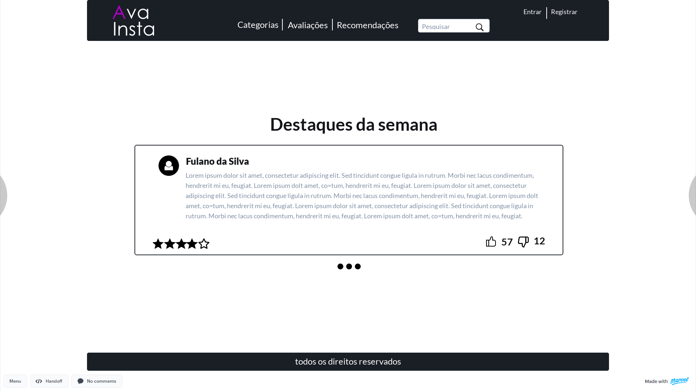

# &ensp;Documento de Identidade Visual
---

## &ensp;Histórico de Revisão

 Data | Versão | Modificação | Autor             
 :---: | :---: | :--- | :---
 31/03/2021 | 0.1 | Criação do documento | Luíz Gustavo
 01/04/2021 | 0.2 | Atualização do documento e inserção dos tópicos 4 e 5 | Luíz Gustavo, Victor

 ---

 ## &ensp;1. Introdução

 &emsp;O documento de identidade visual tem o intuito de listar os componentes visíveis na aplicação AvaInsta, contendo nele tipografia, paleta de cores, logotipo e protótipo de alta fidelidade.

 ## &ensp; 2. Paleta de Cores
 ### &emsp; 2.1 Composição do corpo do site

 &emsp;A paleta de cores escolhida para o site apresenta uma variação de tonalidades predominantemente azul chamada [Muted Neon](https://www.colourlovers.com/palette/4795006/Muted_Neon).
 

#### &emsp; 2.1.1 Código hexadecimal das cores
* girlsonthefloor: #35173B
* Atlanta Surprise 4: #341D47
* jet: #578DAA
* muted neon teal: #52D3A2
* FFBD7F: #FFBD7F

 ### &emsp; 2.2 Composição de cores da tipografia

 #### &emsp; 2.2.1 Textos

 * **Títulos:** #131519.
 * **Textos:** #8190A5.
 * **Menus:** #FFFFFF.

 #### &emsp; 2.2.2 Logotipo

 * **Primeira letra:** #9505bf.
 * **Resto da composição:** #FFFFFF.

 ## &ensp; 3. Logotipo

 &emsp;Foi escolhida para a logotipo uma composição básica de elementos, sendo apenas a palavra *AvaInsta* na fonte *century gotic* quebrada ao meio, com uma fonte de traços simples e não serifada, tendo como destaque a primeira letra em uma cor diferente.

 

 ## &ensp; 4. Tipografia

 ### &emsp; 4.1 Títulos

 Fonte | Tamanho | Espaçamento das linhas | Espaçamento das letras
 :--- | :---: | :---: | :---:
 Lato | 48px | 62px | 0px
 Lato | 23px | auto | 0px
 Lato | 26px | auto | 0px

 ### &emsp; 4.2 Textos
 Fonte | Tamanho | Espaçamento das linhas | Espaçamento das letras
 :--- | :---: | :---: | :---:
 Lato | 18px | 28px | 0px

 ### &emsp; 4.3 Menus
 Fonte | Tamanho | Espaçamento das linhas | Espaçamento das letras
 :--- | :---: | :---: | :---:
 Lato | 24px | 62px | 0px

## &ensp; 5. Protótipo de alta fidelidade

&emsp;Para Acessar o protótipo interativo basat clicar [aqui](https://marvelapp.com/prototype/290j3dhg).

### &emsp; 5.1 Página principal

### &emsp; 5.2 Página de login

### &emsp; 5.3 Página de recomendações

### &emsp; 5.4 Página de avaliações

### &emsp; 5.5 Página de cadastro de avaliações

### &emsp; 5.6 Página de Cadastro de usuário

### &emsp; 5.7 Página de denúncias
