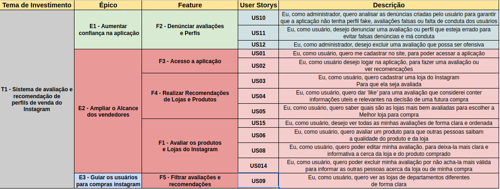

## Histórico de Versões

| Data  | Versão | Descrição  | Autor |   |
|---|---|---|---|---|
| 19/03/2021 | 1.0    | Criação do template              | Felipe, Deivid, Victor, Luiz |
| 21/03/2021 | 1.1    | Adicionado template   atualizado            | Felipe Chemont |

  
  

# Backlog
**Product BackLog** é um artefato no Scrum que visa criar uma lista priorizada do trabalho que deve ser feito para dar vida a um produto.

é um artefato orgânico, que pode ser revisado e atualizado conforme as necessidades do projeto.

Foi elaborado de acordo com a metologia [Safe](https://www.scaledagileframework.com/) composto pelas atividades:

- **Temas de investimento**: Representam o valor chave do produto.
- **Épicos**: Iniciativas de desenvolvimento em larga escala.
- **Features**: Serviços providos pelo sistema
- **Histórias de usuário**: Descrição de uma funcionalidade, pela visão de um usuário
- **Tarefas**: Detalhamento necessário para a realização de uma história de usuário.

O alinhamento do backlog foi feito de acordo com o MVP proposto no projeto, sendo ele todas as funcionalidades descritas de vermelho.

## Referências
* [What is a Product Backlog?](https://www.scrum.org/resources/what-is-a-product-backlog)

* SLIGER, M. (2011). **Agile project management with Scrum**. Paper presented at PMI® Global Congress 2011—North America, Dallas, TX. Newtown Square, PA: Project Management Institute. Disponível em: <https://www.pmi.org/learning/library/agile-project-management-scrum-6269 >. Acesso em 21 de março de 2021. 