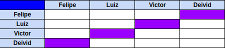

# Planejamento Sprint 02

Sprint dedicada a iniciar o desenvolvimento do Back-End do aplicativo, criando a estrutura de Login e Cadastro de usuário, e finalização da identidade visual do produto para inicio do desenvolvimento do front-end.

## Tamanho da Sprint 02

**Início:** 27/03/2021

**Término:** 03/04/2021

**Duração:** Sete dias

## Objetivos

| Issue | Título | Pontuação | Autor(es) |
|---|---|---|---|
|[#17](https://github.com/AvaInsta/docs/issues/17)| Documento da identidade visual do projeto | 8 | [Luiz Gustavo](https://github.com/LuizGustavoFR), [Victor Rayan](https://github.com/victor-rayan) |
|[#1](https://github.com/AvaInsta/webApp/issues/1)| Cadastro do usuário  | 5 | [Felipe Chermont](https://github.com/chermont04), [Deivid Carvalho](https://github.com/kabalzin) |
|[#2](https://github.com/AvaInsta/webApp/issues/2)| Login de usuário  | 5 | [Felipe Chermont](https://github.com/chermont04), [Deivid Carvalho](https://github.com/kabalzin) |
|[#22](https://github.com/AvaInsta/webApp/issues/22)| Revisão da arquitetura  | 3 | [Felipe Chermont](https://github.com/chermont04), [Deivid Carvalho](https://github.com/kabalzin), [Luiz Gustavo](https://github.com/LuizGustavoFR), [Victor Rayan](https://github.com/victor-rayan) |
|[#6](https://github.com/AvaInsta/webApp/issues/6)| Avaliação de produto   | 8 | [Felipe Chermont](https://github.com/chermont04), [Deivid Carvalho](https://github.com/kabalzin) |

<b>Total de pontos planejados: 29 </b>  

### Dívida

Não houveram dívidas para esta sprint

<b>Total: 0</b> 

 Total de pontos da <i>sprint</i>: 29 
  

<!---Colocar no link abaixo as issues alocadas no milestone da Sprint--->
> [_Sprint_ _Backlog_](https://github.com/AvaInsta/webApp/milestone/2)  

## Pareamentos

## Papeis

***Scrum Master*:** [Deivid Carvalho](https://github.com/kabalzin)

***Product Manager*:** [Felipe Chermont](https://github.com/chermont04)

***Arquiteto:*** [Luiz Gustavo](https://github.com/LuizGustavoFR)

***DevOps*:** [Victor Rayan](https://github.com/victor-rayan)

**Autor:** [Felipe Chermont](https://github.com/chermont04)
