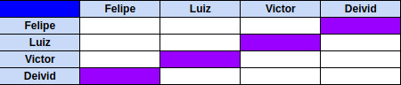
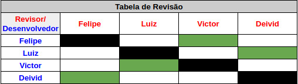

# Planejamento Sprint 04

Finalização do backend e Criação da estratégia de testes. 

## Tamanho da Sprint 04

**Início:** 24/04/2021

**Término:** 01/05/2021

**Duração:** Sete dias

## Objetivos

| Issue | Título | Pontuação | Autor(es) |
|---|---|---|---|
|[#11](https://github.com/AvaInsta/webApp/issues/11)| Denuncia de avaliações e perfils | 5 | [Felipe Chermont](https://github.com/chermont04), [Deivid Carvalho](https://github.com/kabalzin), [Luiz Gustavo](https://github.com/LuizGustavoFR), [Victor Rayan](https://github.com/victor-rayan) |
|[#34](https://github.com/AvaInsta/webApp/issues/34)| Pesquisa e desenvolvimento de Testes  | 5 | [Felipe Chermont](https://github.com/chermont04), [Deivid Carvalho](https://github.com/kabalzin), [Luiz Gustavo](https://github.com/LuizGustavoFR), [Victor Rayan](https://github.com/victor-rayan) |
|[#12](https://github.com/AvaInsta/webApp/issues/12)| Exclusão de avaliação por parte do administrador  | 2 | [Felipe Chermont](https://github.com/chermont04) |

<b>Total de pontos planejados: 12 </b>  

## Dívida

| Issue | Título | Pontuação | Autor(es) |
|---|---|---|---|
|[#32](https://github.com/avainsta/webapp/issues/32)| Página de avaliações do próprio usuário  | 8 | [Felipe Chermont](https://github.com/chermont04) |

<b>Total de pontos da Dívida: 8</b> 

Dividas se deram pelo alto peso da sprint passada.

 Total de pontos da <i>sprint</i>: 20 
  

<!---Colocar no link abaixo as issues alocadas no milestone da Sprint--->
> [_Sprint_ _Backlog_](https://github.com/AvaInsta/webApp/milestone/5)  

## Pareamentos

## Revisão 

## Papeis

***Scrum Master*:** [Deivid Carvalho](https://github.com/kabalzin)

***Product Manager*:** [Felipe Chermont](https://github.com/chermont04)

***Arquiteto:*** [Luiz Gustavo](https://github.com/LuizGustavoFR)

***DevOps*:** [Victor Rayan](https://github.com/victor-rayan)

**Autor:** [Felipe Chermont](https://github.com/chermont04)
