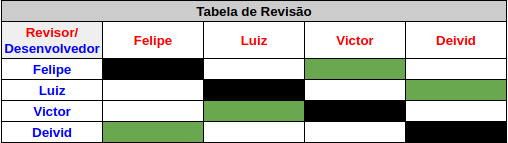

# Planejamento Sprint 06

Finalização do backend e Criação da estratégia de testes. 

## Tamanho da Sprint 06

**Início:** 24/04/2021

**Término:** 01/05/2021

**Duração:** Sete dias

## Objetivos

| Issue | Título | Pontuação | Autor(es) |
|---|---|---|---|
|[#38](https://github.com/AvaInsta/webApp/issues/38)| Teste de Atualização de Avaliação | 3 |[Deivid Carvalho](https://github.com/kabalzin),  [Victor Rayan](https://github.com/victor-rayan) |
|[#37](https://github.com/AvaInsta/webApp/issues/37)| Teste de Criação de Avaliação  | 3 | [Felipe Chermont](https://github.com/chermont04) |
|[#36](https://github.com/AvaInsta/webApp/issues/36)| Teste de Criação de Usuário  | 3 | [Felipe Chermont](https://github.com/chermont04) |
|[#35](https://github.com/AvaInsta/webApp/issues/35)| Fix Image Error  | 3 | [Felipe Chermont](https://github.com/chermont04), [Deivid Carvalho](https://github.com/kabalzin), [Luiz Gustavo](https://github.com/LuizGustavoFR), [Victor Rayan](https://github.com/victor-rayan) |
|[#39](https://github.com/AvaInsta/webApp/issues/39)| Atualizacao da estratégia de testes  | 5 | [Felipe Chermont](https://github.com/chermont04), [Deivid Carvalho](https://github.com/kabalzin), [Luiz Gustavo](https://github.com/LuizGustavoFR), [Victor Rayan](https://github.com/victor-rayan) |

<b>Total de pontos planejados: 12 </b>  

## Dívida

Não houve dívida para esta sprint

<b>Total de pontos da Dívida: 0</b> 

 Total de pontos da <i>sprint</i>: 12 
  

<!---Colocar no link abaixo as issues alocadas no milestone da Sprint--->
> [_Sprint_ _Backlog_](https://github.com/AvaInsta/webApp/milestone/6)  

## Pareamentos

## Revisão 

## Papeis

***Scrum Master*:** [Deivid Carvalho](https://github.com/kabalzin)

***Product Manager*:** [Felipe Chermont](https://github.com/chermont04)

***Arquiteto:*** [Luiz Gustavo](https://github.com/LuizGustavoFR)

***DevOps*:** [Victor Rayan](https://github.com/victor-rayan)

**Autor:** [Felipe Chermont](https://github.com/chermont04)
